# Data Model: TUI Design System

**Branch**: `[002-tui-design-system]` | **Date**: 2026-09-01
**Output of**: `$speckit-plan` Phase 1 (Design & Contracts)

The data model covers the design system types defined in `colors.rs` and `styles.rs`
within the `leiden-tui` crate's `src/ui/` module directory. All public items carry `///`
documentation and `#[derive(Debug)]` where applicable per Constitution Principle IV.
These modules contain only pure data constants and `const fn` functions — no fallible
operations, no I/O, no state mutation.

---

## 1. Color Constants (`colors.rs`)

### 1.1 Base Layer (Backgrounds & Surfaces)

```rust
use ratatui::style::Color;

/// Terminal background — the darkest surface, matching the user's dark
/// terminal theme (`#1a1b26`, Tokyo Night "storm" background).
pub const BG_0: Color = Color::Rgb(26, 27, 38);    // 256: 234

/// Elevated surface — panel interiors and secondary backgrounds.
pub const BG_1: Color = Color::Rgb(31, 32, 46);    // 256: 235

/// Active/focused panel background — used in the status bar.
pub const BG_2: Color = Color::Rgb(36, 38, 58);    // 256: 236

/// Highlighted row / selection background — used for the selected
/// community row in the community panel.
pub const BG_3: Color = Color::Rgb(42, 45, 66);    // 256: 237

/// Hover / transient highlight — used for progress gauge empty area.
pub const BG_4: Color = Color::Rgb(59, 63, 88);    // 256: 240
```

**Validation rules**:
- All background colors are ordered by ascending luminance: `BG_0 < BG_1 < BG_2 < BG_3 < BG_4`.
- Each pair `FG_N on BG_M` must meet WCAG AA contrast ratio ≥ 4.5:1 for the documented pairings (see §6).

### 1.2 Text Layer (Foregrounds)

```rust
/// Bright foreground — titles, selected items, primary values.
/// Matches Tokyo Night `fg` primary: `#c0caf5` = `(192, 202, 245)`.
pub const FG_0: Color = Color::Rgb(192, 202, 245); // 256: 189

/// Normal foreground — body content, table rows, descriptions.
pub const FG_1: Color = Color::Rgb(169, 177, 214); // 256: 146

/// Muted foreground — labels, secondary info, parameter names.
pub const FG_2: Color = Color::Rgb(115, 122, 137); // 256: 245

/// Dim foreground — disabled items, timestamps, key hints.
pub const FG_3: Color = Color::Rgb(86, 95, 113);   // 256: 242
```

**Validation rules**:
- All text colors are ordered by descending luminance: `FG_0 > FG_1 > FG_2 > FG_3`.
- `FG_2 on BG_0` must meet WCAG AA (≥ 4.5:1). This is the weakest documented pairing at 4.7:1.

### 1.3 Semantic Accent Layer

```rust
/// Primary accent blue — focused borders, active selection, help overlay border.
pub const ACCENT_PRIMARY: Color = Color::Rgb(122, 162, 247); // 256: 111

/// Info accent teal — Running state, INFO log level, metrics, quality values.
pub const ACCENT_INFO: Color = Color::Rgb(115, 218, 202);    // 256: 79

/// Warning accent amber — WARN log level, throttle events, iteration cap.
pub const ACCENT_WARNING: Color = Color::Rgb(224, 175, 104); // 256: 214

/// Error accent red — Error state, ERROR log level, quality degradation (ΔQ < 0).
pub const ACCENT_ERROR: Color = Color::Rgb(247, 118, 125);   // 256: 204

/// Success accent green — Done state, quality improvement (ΔQ > 0).
pub const ACCENT_SUCCESS: Color = Color::Rgb(158, 206, 106); // 256: 150
```

**Semantic mapping**:

| Accent | `AppState` | Log Level | Quality Delta |
|---|---|---|---|
| `ACCENT_PRIMARY` | — | — | — |
| `ACCENT_INFO` | `Running` | `INFO` | — |
| `ACCENT_WARNING` | — | `WARN` | — |
| `ACCENT_ERROR` | `Error` | `ERROR` | ΔQ < 0 |
| `ACCENT_SUCCESS` | `Done` | — | ΔQ > 0 |

### 1.4 Community Hash Colors

```rust
/// Deterministic color array for community-id → color mapping.
///
/// Usage: `COMMUNITY_COLORS[community_id as usize % COMMUNITY_COLORS.len()]`
///
/// The 12 colors are chosen for maximum pairwise perceptual distance
/// in CIELAB space, ensuring communities remain distinguishable in
/// both true-color and 256-color modes.
pub const COMMUNITY_COLORS: [Color; 12] = [
    Color::Rgb(122, 162, 247), // C0  blue       256: 111
    Color::Rgb(158, 206, 106), // C1  green      256: 150
    Color::Rgb(224, 175, 104), // C2  amber      256: 214
    Color::Rgb(247, 118, 125), // C3  coral      256: 204
    Color::Rgb(115, 218, 202), // C4  teal       256: 79
    Color::Rgb(187, 154, 247), // C5  lavender   256: 141
    Color::Rgb(255, 158, 100), // C6  orange     256: 209
    Color::Rgb(125, 207, 255), // C7  sky        256: 117
    Color::Rgb(195, 232, 141), // C8  lime       256: 192
    Color::Rgb(255, 167, 196), // C9  pink       256: 218
    Color::Rgb(169, 177, 214), // CA  silver     256: 146
    Color::Rgb(224, 208, 143), // CB  gold       256: 186
];
```

**Validation rules**:
- Array length is exactly 12 (FR-007: `community_id % COMMUNITY_COLORS.len()`).
- The `community_color()` function wraps deterministically via `community_id as usize % COMMUNITY_COLORS.len()`.
- The same `community_id` always maps to the same color across all widgets (cross-panel correspondence per US-2).

### 1.5 Helper Functions (colors.rs)

```rust
/// Get a deterministic color for a community id by hashing into the
/// 12-color community palette.
///
/// Wraps via `community_id % COMMUNITY_COLORS.len()`, ensuring the same community ID
/// always maps to the same color across the community panel and
/// graph view (FR-007).
#[must_use]
pub const fn community_color(community_id: u32) -> Color {
    COMMUNITY_COLORS[community_id as usize % COMMUNITY_COLORS.len()]
}

/// Detect true-color support from environment variables.
///
/// Checks `COLORTERM` first (the standard mechanism), then falls
/// back to `TERM` heuristics for terminals that don't set
/// `COLORTERM` (notably Alacritty, WezTerm).
///
/// Returns `false` as the conservative default when neither
/// variable indicates true-color support (FR-013).
#[must_use]
pub fn supports_truecolor() -> bool {
    if let Ok(ct) = std::env::var("COLORTERM") {
        if ct == "truecolor" || ct == "24bit" {
            return true;
        }
    }
    if let Ok(term) = std::env::var("TERM") {
        if term.starts_with("alacritty")
            || term.starts_with("wezterm")
            || term.ends_with("-direct")
        {
            return true;
        }
    }
    false
}
```

---

## 2. 16-Color ANSI Fallback Palette (`colors.rs`)

### 2.1 Fallback Mapping Table

When `supports_truecolor()` returns `false`, the design system provides a 16-color ANSI fallback palette. This is a parallel set of constants used by the `resolve_color()` function (or a palette struct) to select the appropriate color representation at runtime.

```rust
/// 16-color ANSI fallback for `BG_0`.
pub const BG_0_ANSI: Color = Color::Black;
/// 16-color ANSI fallback for `BG_1`.
pub const BG_1_ANSI: Color = Color::Black;
/// 16-color ANSI fallback for `BG_2`.
pub const BG_2_ANSI: Color = Color::DarkGray;
/// 16-color ANSI fallback for `BG_3`.
pub const BG_3_ANSI: Color = Color::DarkGray;
/// 16-color ANSI fallback for `BG_4`.
pub const BG_4_ANSI: Color = Color::DarkGray;

/// 16-color ANSI fallback for `FG_0`.
pub const FG_0_ANSI: Color = Color::White;
/// 16-color ANSI fallback for `FG_1`.
pub const FG_1_ANSI: Color = Color::Gray;
/// 16-color ANSI fallback for `FG_2`.
pub const FG_2_ANSI: Color = Color::DarkGray;
/// 16-color ANSI fallback for `FG_3`.
pub const FG_3_ANSI: Color = Color::DarkGray;

/// 16-color ANSI fallback for `ACCENT_PRIMARY`.
pub const ACCENT_PRIMARY_ANSI: Color = Color::Blue;
/// 16-color ANSI fallback for `ACCENT_INFO`.
pub const ACCENT_INFO_ANSI: Color = Color::Cyan;
/// 16-color ANSI fallback for `ACCENT_WARNING`.
pub const ACCENT_WARNING_ANSI: Color = Color::Yellow;
/// 16-color ANSI fallback for `ACCENT_ERROR`.
pub const ACCENT_ERROR_ANSI: Color = Color::Red;
/// 16-color ANSI fallback for `ACCENT_SUCCESS`.
pub const ACCENT_SUCCESS_ANSI: Color = Color::Green;

/// 16-color ANSI fallback for community colors.
/// Cycles through 6 ANSI colors for basic distinguishability.
pub const COMMUNITY_COLORS_ANSI: [Color; 6] = [
    Color::Blue,
    Color::Green,
    Color::Yellow,
    Color::Red,
    Color::Cyan,
    Color::Magenta,
];
```

---

## 3. Style Presets (`styles.rs`)

### 3.1 Border & Focus Styles

```rust
use ratatui::style::{Color, Modifier, Style};
use ratatui::widgets::{Block, Borders, BorderType};

/// Style for focused panel borders.
pub const fn focused_border_style() -> Style {
    Style::new().fg(ACCENT_PRIMARY)
}

/// Style for unfocused panel borders.
pub const fn unfocused_border_style() -> Style {
    Style::new().fg(FG_3)
}

/// Style for panel titles when the panel is focused.
pub const fn title_style_focused() -> Style {
    Style::new().fg(FG_0).add_modifier(Modifier::BOLD)
}

/// Style for panel titles when the panel is unfocused.
pub const fn title_style_unfocused() -> Style {
    Style::new().fg(FG_2)
}
```

### 3.2 Table Styles

```rust
/// Style for table column headers.
///
/// Uses `FG_1` (not `FG_2`) for anchoring headers with strong
/// contrast (8.1:1 on `BG_0`, AAA). `FG_2` is reserved for
/// truly secondary labels.
pub const fn header_style() -> Style {
    Style::new().fg(FG_1).add_modifier(Modifier::BOLD)
}

/// Style for selected table row.
///
/// Uses explicit `BG_3` + `FG_0` rather than `Modifier::REVERSED`
/// to ensure consistent rendering across terminals with custom
/// palettes and in 16-color fallback mode (FR-015).
pub const fn selected_row_style() -> Style {
    Style::new().fg(FG_0).bg(BG_3).add_modifier(Modifier::BOLD)
}

/// Style for normal (unselected) table row.
pub const fn normal_row_style() -> Style {
    Style::new().fg(FG_1)
}
```

### 3.3 Status Bar Styles

```rust
/// Style for key hints in the status bar (right-aligned).
pub const fn key_hint_style() -> Style {
    Style::new().fg(FG_3).add_modifier(Modifier::DIM)
}

/// Style for key letters in hints (e.g., the "q" in "q:quit").
pub const fn key_letter_style() -> Style {
    Style::new().fg(FG_2)
}
```

---

## 4. State Theming (`styles.rs`)

### 4.1 `LayoutMode` Enum

```rust
/// Terminal-width-dependent layout arrangement.
///
/// Determines how panels are arranged based on the current
/// terminal width (FR-004).
#[derive(Debug, Clone, Copy, PartialEq, Eq)]
pub enum LayoutMode {
    /// ≥120 columns: community (40%) + graph (60%) side-by-side,
    /// log below (35%), status bar at bottom.
    Full,
    /// 80–119 columns: community (50%) + graph (50%) side-by-side,
    /// log shortened below.
    Compact,
    /// 60–79 columns: community → graph → log in a single column.
    Stacked,
    /// <60 columns: only the focused panel + status bar visible.
    Minimal,
}
```

**Validation rules**:
- `layout_mode(120)` → `LayoutMode::Full`
- `layout_mode(119)` → `LayoutMode::Compact`
- `layout_mode(80)` → `LayoutMode::Compact`
- `layout_mode(79)` → `LayoutMode::Stacked`
- `layout_mode(60)` → `LayoutMode::Stacked`
- `layout_mode(59)` → `LayoutMode::Minimal`

### 4.2 Layout Mode Function

```rust
/// Determine layout mode from terminal width.
///
/// Returns the appropriate [`LayoutMode`] variant based on the
/// current terminal width in columns. Breakpoints follow the
/// responsive design specified in the design system (FR-004).
#[must_use]
pub const fn layout_mode(width: u16) -> LayoutMode {
    match width {
        120.. => LayoutMode::Full,
        80..=119 => LayoutMode::Compact,
        60..=79 => LayoutMode::Stacked,
        _ => LayoutMode::Minimal,
    }
}
```

### 4.3 State Theme Functions

```rust
/// Map `AppState` to its semantic color (FR-003).
///
/// Each state has a unique accent color that is used for the status
/// bar indicator, label, and progress elements.
#[must_use]
pub fn state_color(state: &AppState) -> Color {
    match state {
        AppState::Idle => FG_2,               // muted — waiting
        AppState::Running { .. } => ACCENT_INFO,   // teal — active
        AppState::Done { .. } => ACCENT_SUCCESS,   // green — complete
        AppState::Error(_) => ACCENT_ERROR,        // red — problem
    }
}

/// Map `AppState` to its Unicode indicator symbol (FR-003).
///
/// Each state has a unique symbol that reinforces the state
/// independently of color, ensuring accessibility for users
/// with color vision deficiency.
#[must_use]
pub fn state_indicator(state: &AppState) -> &'static str {
    match state {
        AppState::Idle => "○",           // U+25CB WHITE CIRCLE
        AppState::Running { .. } => "●", // U+25CF BLACK CIRCLE
        AppState::Done { .. } => "✓",    // U+2713 CHECK MARK
        AppState::Error(_) => "✗",       // U+2717 BALLOT X
    }
}

/// Map `AppState` to its human-readable label (FR-003).
#[must_use]
pub fn state_label(state: &AppState) -> &'static str {
    match state {
        AppState::Idle => "Idle",
        AppState::Running { .. } => "Running",
        AppState::Done { .. } => "Done",
        AppState::Error(_) => "Error",
    }
}
```

### 4.4 Log Severity Styles

```rust
/// Style for log level `[ERROR]` prefix (FR-008).
pub const fn log_error_style() -> Style {
    Style::new().fg(ACCENT_ERROR).add_modifier(Modifier::BOLD)
}

/// Style for log level `[WARN]` prefix (FR-008).
pub const fn log_warn_style() -> Style {
    Style::new().fg(ACCENT_WARNING).add_modifier(Modifier::BOLD)
}

/// Style for log level `[INFO]` prefix (FR-008).
pub const fn log_info_style() -> Style {
    Style::new().fg(ACCENT_INFO)
}

/// Style for log level `[DEBUG]` prefix (FR-008).
pub const fn log_debug_style() -> Style {
    Style::new().fg(FG_2)
}

/// Style for log level `[TRACE]` prefix (FR-008).
pub const fn log_trace_style() -> Style {
    Style::new().fg(FG_3).add_modifier(Modifier::DIM)
}
```

### 4.5 Block Builder Functions

```rust
/// Create a focused panel block with accent border and bold title.
///
/// Uses `BorderType::Rounded` (FR-010) and `ACCENT_PRIMARY` border
/// color to indicate keyboard focus (FR-006).
pub fn focused_block(title: &str) -> Block<'_> {
    Block::default()
        .title(format!(" {title} "))
        .title_style(title_style_focused())
        .borders(Borders::ALL)
        .border_type(BorderType::Rounded)
        .border_style(focused_border_style())
}

/// Create an unfocused panel block with dim border and muted title.
///
/// Uses `BorderType::Rounded` (FR-010) and `FG_3` border color
/// for non-focused panels.
pub fn unfocused_block(title: &str) -> Block<'_> {
    Block::default()
        .title(format!(" {title} "))
        .title_style(title_style_unfocused())
        .borders(Borders::ALL)
        .border_type(BorderType::Rounded)
        .border_style(unfocused_border_style())
}

/// Create the appropriate panel block based on focus state.
///
/// Convenience function that dispatches to [`focused_block`] or
/// [`unfocused_block`] based on whether the panel is currently focused.
pub fn panel_block(title: &str, is_focused: bool) -> Block<'_> {
    if is_focused {
        focused_block(title)
    } else {
        unfocused_block(title)
    }
}
```

---

## 5. Unicode Symbol Constants (`styles.rs`)

```rust
/// State indicator for `AppState::Idle` — white circle (U+25CB).
pub const INDICATOR_IDLE: &str = "○";
/// State indicator for `AppState::Running` — black circle (U+25CF).
pub const INDICATOR_RUNNING: &str = "●";
/// State indicator for `AppState::Done` — check mark (U+2713).
pub const INDICATOR_DONE: &str = "✓";
/// State indicator for `AppState::Error` — ballot x (U+2717).
pub const INDICATOR_ERROR: &str = "✗";
/// Graph node symbol — black circle (U+25CF).
pub const GRAPH_NODE: &str = "●";
/// Sort indicator — black down-pointing triangle (U+25BC).
pub const SORT_DESC: &str = "▼";
/// Separator dot — middle dot (U+00B7).
pub const SEPARATOR_DOT: &str = "·";
/// Arrow right — rightwards arrow (U+2192).
pub const ARROW_RIGHT: &str = "→";
/// Greek gamma — for resolution parameter display (U+03B3).
pub const GAMMA: &str = "γ";
/// Greek delta — for quality delta display (U+0394).
pub const DELTA: &str = "Δ";
```

---

## 6. Contrast Ratio Verification Table

All documented foreground-background pairings and their WCAG compliance status. This table serves as the test oracle for contrast ratio unit tests.

| Foreground | Background | Ratio | WCAG Level | Used In |
|---|---|---|---|---|
| `FG_0` (#c0caf5) | `BG_0` (#1a1b26) | 11.1:1 | AAA | Titles, selected values |
| `FG_1` (#a9b1d6) | `BG_0` (#1a1b26) | 8.1:1 | AAA | Body text, table rows |
| `FG_2` (#737a89) | `BG_0` (#1a1b26) | 4.7:1 | AA | Labels, muted text |
| `FG_1` (#a9b1d6) | `BG_1` (#1f202e) | 7.4:1 | AAA | Help overlay text |
| `FG_0` (#c0caf5) | `BG_3` (#2a2d42) | 7.5:1 | AAA | Selected row text |
| `ACCENT_PRIMARY` (#7aa2f7) | `BG_0` (#1a1b26) | 6.3:1 | AA | Focused borders |
| `ACCENT_ERROR` (#f7767d) | `BG_0` (#1a1b26) | 5.8:1 | AA | Error indicators |
| `ACCENT_SUCCESS` (#9ece6a) | `BG_0` (#1a1b26) | 8.4:1 | AAA | Success indicators |
| `ACCENT_INFO` (#73daca) | `BG_0` (#1a1b26) | 10.1:1 | AAA | Info indicators |
| `ACCENT_WARNING` (#e0af68) | `BG_0` (#1a1b26) | 7.8:1 | AAA | Warning indicators |

---

## 7. Entity Relationships

```mermaid
graph TD
    subgraph "colors.rs"
        BG["Base Layer<br/>BG_0..BG_4"]
        FG["Text Layer<br/>FG_0..FG_3"]
        ACC["Accent Layer<br/>ACCENT_*"]
        COMM["Community Colors<br/>COMMUNITY_COLORS[12]"]
        TC["supports_truecolor()"]
        CC["community_color()"]
        ANSI["ANSI Fallback<br/>*_ANSI constants"]
    end

    subgraph "styles.rs"
        BORDER["Border Styles<br/>focused/unfocused"]
        TABLE["Table Styles<br/>header/selected/normal"]
        STATUS["Status Bar Styles<br/>key_hint/key_letter"]
        LOG["Log Severity Styles<br/>error/warn/info/debug/trace"]
        STATE["State Theme<br/>state_color/indicator/label"]
        LAYOUT["LayoutMode<br/>layout_mode()"]
        BLOCK["Block Builders<br/>focused_block/unfocused_block"]
        SYMBOLS["Unicode Symbols<br/>INDICATOR_*/GRAPH_NODE/..."]
    end

    subgraph "app.rs (existing)"
        APP["AppState<br/>Idle/Running/Done/Error"]
        FOCUS["FocusPanel<br/>CommunityList/GraphView/LogPane"]
        VIS["PanelVisibility<br/>show_graph/show_log/help_open"]
    end

    BORDER --> BG
    BORDER --> FG
    BORDER --> ACC
    TABLE --> BG
    TABLE --> FG
    STATUS --> FG
    LOG --> ACC
    LOG --> FG
    STATE --> ACC
    STATE --> FG
    STATE --> APP
    BLOCK --> BORDER
    CC --> COMM
    TC --> ANSI
    LAYOUT --> VIS
```



---

## 8. Module Dependency Map

```text
ui/mod.rs (render dispatcher)
├── imports colors.rs  → color constants, community_color(), supports_truecolor()
├── imports styles.rs  → style presets, LayoutMode, layout_mode(), block builders
├── uses    app.rs     → App, AppState, FocusPanel, PanelVisibility
│
├── ui/community.rs    → colors.rs (community_color, FG_*, BG_*)
│                       → styles.rs (header_style, selected_row_style, panel_block)
│
├── ui/graph.rs        → colors.rs (community_color, FG_*)
│                       → styles.rs (panel_block)
│
├── ui/log_pane.rs     → colors.rs (FG_*, ACCENT_*)
│                       → styles.rs (log_*_style, panel_block)
│
└── ui/status_bar.rs   → colors.rs (BG_2, FG_*, ACCENT_*)
                        → styles.rs (state_color, state_indicator, state_label,
                                     key_hint_style, key_letter_style)
```
